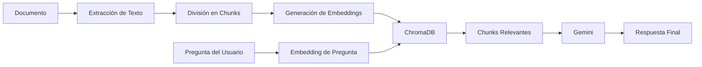

# 📄 Chat Multidocumento con ChromaDB + Gemini + Streamlit

## 📖 Introducción

**Chat Multidocumento** es una aplicación web interactiva que te permite "conversar" con tus archivos de diversos formatos, incluyendo **PDF, DOCX, TXT, HTML, CSV y XLSX**. Sube tus documentos, haz preguntas en lenguaje natural y obtén respuestas precisas basadas en el contenido extraído. 

La aplicación utiliza técnicas avanzadas de **Retrieval-Augmented Generation (RAG)** para proporcionar respuestas contextuales y precisas, eliminando las "alucinaciones" típicas de los modelos de lenguaje al forzarlos a responder únicamente con información presente en el archivo cargado.

---

## ✨ ¿Por qué esta Stack Tecnológica?

### 🗄️ **ChromaDB**
ChromaDB es una base de datos vectorial de código abierto diseñada específicamente para aplicaciones de IA.

**Ventajas:**
- ⚡ **Configuración Óptima**: No requiere instalación de servidores ni configuraciones complejas
- 🚀 **Búsqueda semántica**: Encuentra información relevante por significado, no solo por palabras clave
- 💾 **Eficiente en memoria**: Ideal para prototipos y aplicaciones locales
- 🔍 **Embeddings nativos**: Soporte integrado para vectores de alta dimensión
- 🎯 **Resultados precisos**: Recupera los fragmentos de texto más relevantes para cada pregunta

### 🤖 **Google Gemini**
Gemini es el modelo de lenguaje de última generación de Google, utilizado para generar respuestas naturales.

**Ventajas:**
- 🧠 **Comprensión avanzada**: Entiende contexto complejo y matices del lenguaje
- 💰 **Capa gratuita**: Perfecto para desarrollo y proyectos pequeños
- ⚡ **Respuestas rápidas**: Modelo optimizado para baja latencia
- 🌍 **Multilingüe**: Soporte excelente para español y otros idiomas
- 🔒 **Control mediante prompts**: Fácil de configurar para evitar respuestas inventadas

### 🎨 **Streamlit**
Streamlit es un framework de Python para crear aplicaciones web de ciencia de datos de forma rápida.

**Ventajas:**
- 🐍 **100% Python**: No necesitas HTML, CSS ni JavaScript
- ⚡ **Desarrollo rápido**: De idea a aplicación funcional en poco tiempo
- 📱 **Responsive por defecto**: Se adapta a diferentes dispositivos
- 🎨 **Componentes listos para usar**: File uploaders, botones, spinners y más

---

## 🏗️ Arquitectura del Proyecto

```
chatpdf/
│
├── app.py                  # Aplicación principal de Streamlit
├── requirements.txt        # Dependencias del proyecto
├── .env                    # Variables de entorno (API Keys)
├── formats/                # Carpeta para documentos de prueba
└── README.md               # Este archivo
```

---

## 🔧 Requisitos Previos

### 📌 Versión de Python
Este proyecto requiere **Python 3.10.x** (recomendado: 3.10.11 o superior dentro de la serie 3.10).

Verifica tu versión de Python:
```bash
python --version
```

Si necesitas instalar Python 3.10:
- **Windows**: Descarga desde [python.org](https://www.python.org/downloads/)
- **macOS**: Usa Homebrew `brew install python@3.10`
- **Linux**: Usa el gestor de paquetes de tu distribución

### 🔑 API Key de Google Gemini
Necesitas una clave API de Google Gemini (gratuita):

1. Ve a [Google AI Studio](https://makersuite.google.com/app/apikey)
2. Inicia sesión con tu cuenta de Google
3. Haz clic en "Create API Key"
4. Copia la clave generada

---

## 🚀 Instalación y Configuración

### 1️⃣ Clonar el Repositorio

```bash
git clone https://github.com/bluerzu/chatpdf.git
cd chatpdf
```
---

### 2️⃣ Crear Entorno Virtual

Es **altamente recomendado** usar un entorno virtual para aislar las dependencias del proyecto.

#### 🪟 **Windows (CMD)**

```cmd
# Crear entorno virtual
python -m venv .venv

# Activar entorno virtual
.venv\Scripts\activate
```

#### 🍎 **macOS / Linux**

```bash
# Crear entorno virtual
python3.10 -m venv .venv

# Activar entorno virtual
source .venv/bin/activate
```

**Nota:** Una vez activado, verás `(.venv)` al inicio de tu línea de comandos.

---

### 3️⃣ Instalar Dependencias

Con el entorno virtual activado:

```bash
pip install -r requirements.txt
```

**Dependencias principales:**
- `streamlit` → Framework web
- `chromadb` → Base de datos vectorial
- `pypdf` → Extracción de texto de PDFs
- `sentence-transformers` → Generación de embeddings locales
- `google-generativeai` → Cliente de Gemini
- `python-dotenv` → Gestión de variables de entorno
- `python-docx` → Procesamiento y extracción de texto de archivos Word (.docx).
- `pandas` & `openpyxl` → Manipulación de datos y lectura de archivos Excel y CSV.
- `beautifulsoup4` → Limpieza y extracción de contenido de archivos HTML.

---

### 4️⃣ Configurar Variables de Entorno

Crea un archivo `.env` en la raíz del proyecto:

```
GOOGLE_API_KEY=AIzaSyXXXXXXXXXXXXXXXXXXXXXXXXXX
```

**⚠️ IMPORTANTE:** 
- Reemplaza `tu_api_key_aqui` con tu clave real de Gemini
---

### 5️⃣ Ejecutar la Aplicación

Con el entorno virtual activado y las dependencias instaladas:

```bash
streamlit run app.py
```

La aplicación se abrirá automáticamente en tu navegador en:
```
http://localhost:8501
```

---

## 📘 Cómo Usar la Aplicación

1. **Sube un documento** usando el botón de carga
2. **Procesa el documento** haciendo clic en "Drag and drop file here"
3. **Espera** mientras el sistema:
   - Extrae el texto del documento
   - Divide el texto en fragmentos (chunks)
   - Genera embeddings vectoriales
   - Almacena los datos en ChromaDB
4. **Haz preguntas** en lenguaje natural sobre el contenido
5. **Obtén respuestas** precisas basadas en el documento
6. **Revisa el contexto** usado para generar cada respuesta (sección expandible)

---

## 🔍 Cómo Funciona (RAG Pipeline)



1. **Extracción Multiformato**: El sistema detecta automáticamente el tipo de archivo y extrae el texto usando:
   - **PyPDF** para archivos PDF.
   - **python-docx** para Word.
   - **Pandas** para Excel y CSV (con detección automática de separadores).
   - **BeautifulSoup** para HTML.
2. **Chunking**: Texto dividido en fragmentos de 500 caracteres con solapamiento de 100
3. **Embeddings**: Modelo `all-MiniLM-L6-v2` convierte texto a vectores numéricos
4. **Almacenamiento**: ChromaDB indexa los vectores para búsqueda semántica
5. **Búsqueda**: Pregunta → Embedding → Top 4 chunks más similares
6. **Generación**: Gemini genera respuesta usando solo el contexto recuperado

---

## 🔄 Detección de Cambios de Archivos

La aplicación incluye un sistema inteligente de detección de cambios que evita el reprocesamiento innecesario de documentos:

### Hash SHA-256
Cada vez que subes un archivo (PDF, DOCX, CSV, XLSX, TXT o HTML), la aplicación genera un hash SHA-256 único del archivo usando la biblioteca hashlib de Python. Este hash actúa como una "huella digital" del documento.

**Cómo funciona:**
```python
def hash_pdf(file) -> str:
    return hashlib.sha256(file.getvalue()).hexdigest()
```

### Reseteo Automático de Estado
Si subes un documento diferente (hash diferente), la aplicación automáticamente:
- 🗑️ Limpia la colección de ChromaDB anterior
- 🔄 Resetea el estado de procesamiento
- 📥 Te permite procesar el nuevo documento

**Beneficios:**
- ✅ Evita procesamiento duplicado del mismo documento
- ✅ Detecta instantáneamente cambios en el documento
- ✅ Mejora la eficiencia y experiencia del usuario
- ✅ Previene errores por mezcla de datos de diferentes documentos

---

## ⚙️ Personalización

### Ajustar el tamaño de chunks

En `app.py` línea 254, puedes modificar:

```python
chunks = chunk_text(text, chunk_size=800, overlap=160)
```

- **`chunk_size`**: Tamaño de cada fragmento (400-800 caracteres recomendado)
- **`overlap`**: Solapamiento entre fragmentos (10-20% del chunk_size)

### Cambiar el modelo de embeddings

En `app.py` línea 26, puedes usar otros modelos de [sentence-transformers](https://huggingface.co/sentence-transformers):

```python
EMBEDDING_MODEL = SentenceTransformer("all-MiniLM-L6-v2")
```

Opciones populares:
- `all-MiniLM-L6-v2` (rápido, ligero)
- `paraphrase-multilingual-MiniLM-L12-v2` (mejor para español)
- `all-mpnet-base-v2` (más preciso, más lento)

### Modificar el modelo de Gemini

En `app.py` línea 175:

```python
model = genai.GenerativeModel("models/gemini-2.5-flash-lite")
```

Otros modelos disponibles:
- `gemini-3-flash` 
- `gemini-2.5-flash`

---

## 🐛 Solución de Problemas

### ❌ Error: "Module not found"
```bash
# Asegúrate de tener el entorno virtual activado
pip install -r requirements.txt
```

### ❌ Error: "Invalid API Key"
- Verifica que tu `.env` existe y tiene la clave correcta
- Revisa que no haya espacios extra en el archivo `.env`
- Regenera tu API Key en Google AI Studio

### ❌ Error al procesar documento
- Asegúrate de que el documento no esté protegido con contraseña
- Verifica que el documento contiene texto

### ❌ La app no se abre en el navegador
```bash
# Abre manualmente en:
http://localhost:8501
```

---

## 📚 Recursos Adicionales

- [Documentación de Streamlit](https://docs.streamlit.io/)
- [ChromaDB Docs](https://docs.trychroma.com/)
- [Gemini API Documentation](https://ai.google.dev/docs)
- [Sentence Transformers](https://www.sbert.net/)
- [Modelos de Gemini y Precios](https://ai.google.dev/gemini-api/docs/pricing)
- [Límites de Rate de Gemini](https://ai.google.dev/gemini-api/docs/rate-limits)

---

## 🤝 Contribuciones

Las contribuciones son bienvenidas.

---

## 📄 Licencia

Este proyecto está bajo la Licencia MIT. Consulta el archivo `LICENSE` para más detalles.

---
## Recomendaciones hechas

- [ ] Soporte para diferentes formatos (.docx, .txt, .html, .xlsx, .csv)

## 🎯 Próximos Pasos Sugeridos

- [ ] Persistencia de la base de datos entre sesiones
- [ ] Soporte para documentos escaneados (OCR)
- [ ] Interfaz multiidioma
- [ ] Sistema de historial de preguntas
